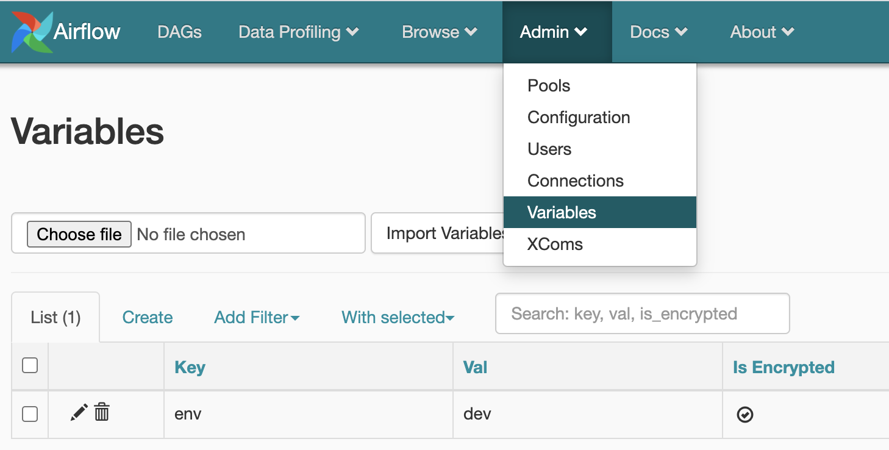

# Deployment

One of the key features of BigFlow is the full automation of the build and deployment process.
BigFlow can dockerize your workflows and deploy them to Google Cloud Composer.

## GCP runtime environment

BigFlow GCP runtime environment consists of two services:

1. Google [Cloud Composer](#cloud-composer),
2. [Docker Registry](#docker-registry).

Typically, for one software project, teams use one or more
GCP projects (for dev, test, and prod environments)
and one long-running Composer instance per each GCP project.

Docker images are heavy files, so pushing them only once to GCP greatly
reduces subsequent deployment time (it's safe because images are immutable).
That's why we recommend using a single Docker Registry instance of,
shared by all environments. 
  
There are two [deployment artifacts](project_setup_and_build.md#deployment-artifacts):

1. Airflow DAG files with workflows definitions,
1. a Docker image with workflows computation code.

During deployment, BigFlow uploads your DAG files to Composer's [DAGs folder](#composers-dags-folder)
and pushes your Docker image to Docker Registry.

Read more about deployment artifacts in [Project setup and build](project_setup_and_build.md).

## Cloud Composer

Shortly speaking, a Cloud Composer is Airflow-as-a-Service.

Unfortunately for Python users, Composer's architecture is flawed
because Python libraries required by DAGs have to be
[installed manually](https://cloud.google.com/composer/docs/how-to/using/installing-python-dependencies) on Composer.
To make it worse, installing dependencies forces a Composer instance to restart.
It not only takes time but often fails. In the worst scenario, you need to spawn a new Composer instance.
 
BigFlow fixes these problems by using Docker. Each of your [jobs](workflow-and-job.md)
is executed in a stable and isolated runtime environment &mdash; a Docker container.

On GCP you execute Docker images on Kubernetes.
BigFlow leverages the fact that each Composer instance
stands on its own ([GKE](https://cloud.google.com/kubernetes-engine)) cluster.
This cluster is reused by BigFlow.

### Composer's service account

Before you start you will need a [GCP project](https://cloud.google.com/resource-manager/docs/creating-managing-projects)
and a [Service account](https://cloud.google.com/iam/docs/service-accounts). 

That's important. All permissions required by a Composer itself and by your jobs have to be granted to this account.

We recommend using a [default service account](https://cloud.google.com/compute/docs/access/service-accounts#default_service_account)
as a Composer's account.
This account is created automatically for each GCP project. It has the following email:

```
PROJECT_NUMBER-compute@developer.gserviceaccount.com
```

### Setting up a Composer Instance

[Create](https://cloud.google.com/composer/docs/quickstart)
a new Composer instance. Set only these properties (the others leave blank or default):

* **Location** &mdash; close to you,
* **Machine type** &mdash; `n1-standard-2` or higher (we recommend to stay with `n1-standard-2`),
* **Disk size (GB)** &mdash; 50 is enough.
  
That's it, wait until the new Composer Instance is ready.
It should look like this:


### Composer's DAGs Folder
Composer's DAGs Folder is a Cloud Storage [bucket](https://cloud.google.com/storage/docs/json_api/v1/buckets)
mounted to Airflow. This is the place where BigFlow uploads your DAG files.

Go to the Composer's **DAGs folder**:
 

 
and note the [bucket's](https://cloud.google.com/storage/docs/json_api/v1/buckets) name
(here `europe-west1-my-first-compo-ba6e3418-bucket`).

Put this bucket name into the `dags_bucket` property in your
[`deployment_config.py`](#managing-configuration-in-deployment_configpy). For example:

```python
'dags_bucket': 'europe-west1-my-first-compo-ba6e3418-bucket'
```

### Airflow Variables

Create the `env` variable in the Airflow web UI:



It is used by BigFlow to select the proper configuration from [Config](configuration.md) objects in your project.    

## Docker Registry

[Docker Registry](https://docs.docker.com/registry/) is a repository where Docker images are stored.

We recommend using Google Cloud [Container Registry](https://cloud.google.com/container-registry)
because it integrates seamlessly with Composer.

### Docker repository name

One Container Registry can hosts many image repositories.
We recommend having one image repository per one BigFlow project.

You don't need to create repositories explicitly, they are barely namespaces.
All you need is to put the full repository name into the `docker_repository` property in 
[`deployment_config.py`](#managing-configuration-in-deployment_configpy). For example:

```python
'docker_repository': 'eu.gcr.io/my_gcp_dev_project/my-bigflow-project'
```

### Docker Registry permissions

Ensure that your Composers have permission to pull images from a Registry. 

If a Composer's service account is a  
[default service account](https://cloud.google.com/compute/docs/access/service-accounts#default_service_account)
and if it wants to pull from a Container Registry located in the same GCP project &mdash;
it has the pull permission by default.

Otherwise, you have to grant read permission to a [bucket](https://cloud.google.com/storage/docs/json_api/v1/buckets),
which underlies your Registry (**Storage Object Viewer** is enough).

Read more about Container Registry [access control](https://cloud.google.com/container-registry/docs/access-control).

#### How to find a bucket behind your Container Registry

Finding a bucket behind your Container Registry is not straightforward, because it's not linked anywhere.
Moreover, its naming policy is somehow confusing ([read more](https://cloud.google.com/container-registry/docs/access-control#grant-bucket) about this policy).

In the GCP project which hosts your Container Registry, go to [Storage](https://cloud.google.com/storage)
browser. There should be a bucket with the `artifacts` phrase in its name

## Managing configuration in deployment_config.py

Deployment requires configuration properties. 
You can pass them to BigFlow directly as command-line arguments, but it's better to save them in a `deployment_config.py` file.
We recommend this approach (called [Configuration as Code](https://rollout.io/blog/configuration-as-code-everything-need-know/))
for local development and CI/CD.

The `deployment_config.py` can be placed in the main folder of your project.
It has to contain a [`bigflow.Config`](configuration.md) object stored in the `deployment_config` variable. 

The following properties are read by BigFlow from `deployment_config.py` if not provided as command-line arguments:

1. `gcp_project_id` &mdash; Composer's project ID, 
1. `dags_bucket` &mdash; Composer's [DAGs Folder](#composers-dags-folder),
1. `docker_repository` &mdash; full name of a [Docker repository](#docker-repository-name),
1. `vault_endpoint` &mdash; an Vault endpoint to obtain OAuth token, used only if
   [Service account authentication](#service-account-authentication) is chosen.

Here is the recommended structure of the `deployment_config.py` file:

```python
from biggerquery import Config
deployment_config = Config(name='dev',                    
                           properties={
                               'gcp_project_id': 'my_gcp_dev_project',
                               'docker_repository_project': '{gcp_project_id}',
                               'docker_repository': 'eu.gcr.io/{docker_repository_project}/my-bigflow-project',
                               'vault_endpoint': 'https://example.com/vault',
                               'dags_bucket': 'europe-west1-my-first-compo-ba6e3418-bucket'
                           })\
        .ad_configuration(name='prod', properties={
                               'gcp_project_id': 'my_gcp_prod_project',
                               'dags_bucket': 'europe-west1-my-first-compo-1111111-bucket'})
``` 

Having that, you can run the extremely concise `deploy` command, for example:  

```bash 
bigflow deploy-dags --config dev
```

## Authentication methods

BigFlow supports two GCP authentication methods: local account and service account.

### Local Account Authentication

The local account method is used for local development.
It relies on your local user `gcloud` account.
Check if you are authenticated by typing:

```bash
gcloud info
```  

### Service Account Authentication

The service account method is designed to automate your BigFlow deployment using CI/CD servers. 
It is based on the Vault secrets engine. Think about Vault as an additional layer of indirection between your code
and GCP service accounts.

Key concepts:

* [Vault secrets engine](https://www.vaultproject.io/docs/secrets/gcp)
  &mdash; additional server (not provided by GCP) used by 
  BigFlow to authenticate on a given service account.
* [service account](https://cloud.google.com/iam/docs/service-accounts) &mdash;
  a technical account not intended to be used by humans,
  should have the right permissions required to execute a given BigFlow [command](cli.md).    
* Vault endpoint &mdash; a REST endpoint with a unique URL, exposed by Vault for each service account.
  When queried (GET), generates a short-living OAuth token.
* secret Vault-Token &mdash; a secret, that protects access to a Vault endpoint.
  Shouldn't be stored in Git.  

#### Vault integration

To use service account authentication you have to pass 
two configuration parameters to BigFlow [CLI](cli.md):
`vault_endpoint` and `vault_secret`. 
While the `vault_endpoint` parameter can (and should) be stored in [`deployment_config.py`](#managing-configuration-in-deployment_configpy)
&mdash; `vault_secret` shouldn't be stored in Git. We recommend to keep it on your CI/CD server.

## Deployment permission

Deployment means uploading various files to Cloud Storage 
[buckets](https://cloud.google.com/storage/docs/json_api/v1/buckets):

1. Docker images are uploaded to a
   [bucket behind Container Registry](#how-to-find-a-bucket-behind-your-container-registry).
   write access to this bucket is required.
1. DAG files are uploaded to a bucket behind [Composer's DAGs Folder](#composers-dags-folder),
   write and delete access to this bucket is required.
   
In both cases, we recommend granting the project-level
**Storage Object Admin** role to a user account or a service account used for deployment.

Of course, you can also grant bucket-level access only to these two buckets.


