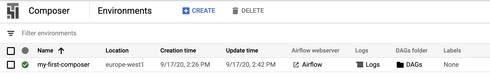
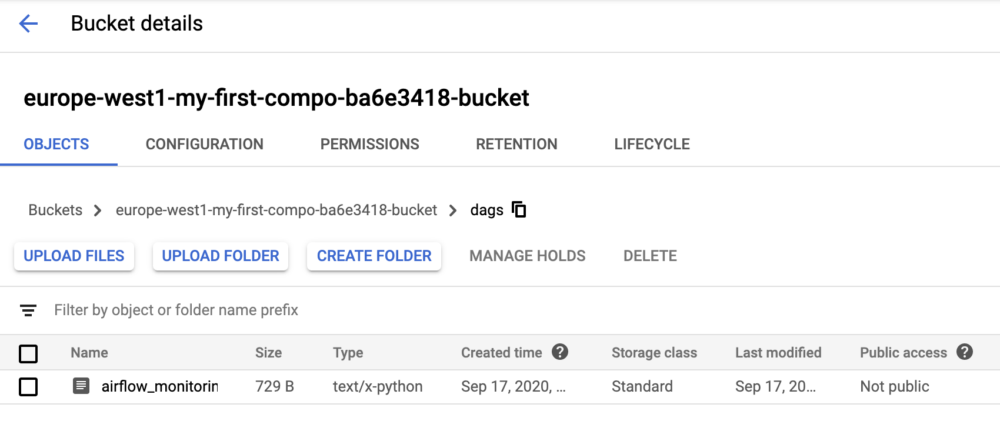

# Deployment

One of the key features of BigFlow is the full automation of the build and deployment process.
BigFlow can dockerize your workflows and deploy them to Google Cloud Composer.

## GCP runtime environment

GCP runtime environment consists of two services:

1. Google [Cloud Composer](#cloud-composer),
2. [Docker Registry](#docker-registry).

There are two [deployment artifacts](project_setup_and_build.md#deployment-artifacts):

1. Airflow DAG files with workflows definitions,
1. a Docker image with workflows computation code.

During deployment, BigFlow uploads your DAG files to Composer's [DAGs folder](#composers-dags-folder)
and pushes your Docker image to Docker Registry.

Typically, for one project, teams use two or more Composer instances (dev, test, prod)
and a single, shared instance of Docker Registry.
Docker images are heavy files, so pushing them only once to GCP greatly
reduces subsequent deployments time (it's safe, because images are immutable). 

Read more about deployment artifacts in [Project setup and build](project_setup_and_build.md).

## Cloud Composer

Shortly speaking, a Cloud Composer is Airflow-as-a-Service.

Unfortunately for Python users, Composer's architecture is flawed
because Python libraries required by DAGs have to be
[installed manually](https://cloud.google.com/composer/docs/how-to/using/installing-python-dependencies) on Composer.
To make it worse, installing dependencies forces a Composer instance to restart.
It not only takes time, but often fails. In the worst scenario, you need to spawn a new Composer instance.
 
BigFlow fixes these problems by using Docker. Each of your [jobs](workflow-and-job.md)
is executed in a stable and isolated runtime environment &mdash; a Docker container.

On GCP you execute Docker images on Kubernetes.
BigFlow leverages the fact that each Composer instance
stands on its own ([GKE](https://cloud.google.com/kubernetes-engine)) cluster.
This cluster is reused by BigFlow.

### Composer's Service account

Before you start you will need a [GCP project](https://cloud.google.com/resource-manager/docs/creating-managing-projects)
and a [Service account](https://cloud.google.com/iam/docs/service-accounts) name. 
It looks like an email address, for example:

```
*********-compute@developer.gserviceaccount.com
```

That's important. All permissions required by a Composer itself and by your jobs have to be granted to this account.
To make things more secure, we recommend to use a dedicated service accounts for each Composer instance
(dev, test, prod).

### Setting up a Composer Instance

[Create](https://cloud.google.com/composer/docs/quickstart)
a new Composer instance. Set only these properties (the others leave blank or default):

* **Location** &mdash; close to you,
* **Machine type** &mdash; `n1-standard-2` or higher (we recommend to stay with `n1-standard-2`),
* **Disk size (GB)** &mdash; 50 is enough,
* **Service account** &mdash; a Service account which will be running this environment,
  for example `*********-compute@developer.gserviceaccount.com`.
  
That's it, wait until the new Composer Instance is ready.
It should look like this:



### Composer's DAGs Folder

Go to the Composer's **DAGs folder**:
 

 
and note the [bucket](https://cloud.google.com/storage/docs/json_api/v1/buckets) name
(here `europe-west1-my-first-compo-ba6e3418-bucket`).

Put the bucket name into the `dags_bucket` property in your
[`deployment_config.py`](#managing-configuration-in-deployment_configpy).

## Docker Registry

[Docker Registry](https://docs.docker.com/registry/) is a repository
where your Docker images are stored.

We recommend using Google Cloud [Container Registry](https://cloud.google.com/container-registry)
because it integrates seamlessly with Composer. 

All you need to know is choose 
//TODO

## Managing configuration in deployment_config.py

Deploy commands require a lot of configuration. You can pass all parameters directly as command-line arguments,
or save them in a `{project_dir}`deployment_config.py` file.

For local development and for most CI/CD scenarios we recommend using a `deployment_config.py` file.
This file has to contain a [`bigflow.Config`](configuration.md) 
object stored in the `deployment_config` variable
and can be placed in the main folder of your project.

`deployment_config.py` example:

```python
from biggerquery import Config
deployment_config = Config(name='dev',                    
                           properties={
                               'gcp_project_id': 'my_gcp_dev_project',
                               'docker_repository_project': '{gcp_project_id}',
                               'docker_repository': 'eu.gcr.io/{docker_repository_project}/my-project',
                               'vault_endpoint': 'https://example.com/vault',
                               'dags_bucket': 'europe-west1-123456-bucket'
                           })\
        .ad_configuration(name='prod', properties={
                               'gcp_project_id': 'my_gcp_prod_project',
                               'dags_bucket': 'europe-west1-654321-bucket'})
``` 

Having that, you can run the extremely concise `deploy` command, for example:  

```bash 
bigflow deploy-dags --config dev
```

## Authentication methods

Bigflow supports two GCP authentication methods: **local account** and **service account**.

1. **local account** for local development, 
2.  authentication which 

### Local Account Authentication

The local account method is used for local development.
It relies on your local user `gcloud` account.
Check if you are authenticated by typing:

```bash
gcloud info
```  

### Service Account Authentication

The Service account method is typically used on CI/CD servers.
It allows you to authenticate with a [service account](https://cloud.google.com/iam/docs/service-accounts) 
as long as you have a [Vault](https://www.vaultproject.io/) server for managing OAuth tokens.

## Vault
