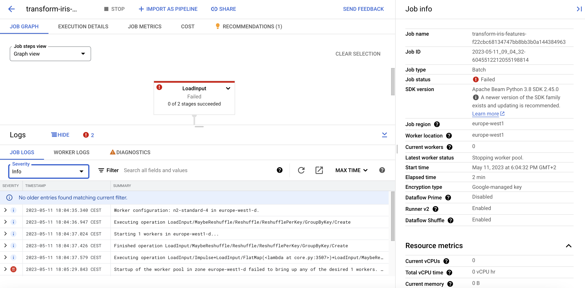
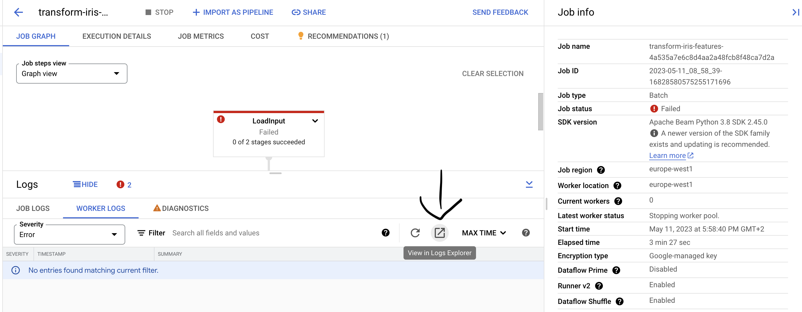

# Monitoring

## Monitoring DAGs failures

The easiest way to monitor your processes is to use Cloud Composer [DAG metrics](https://cloud.google.com/composer/docs/monitoring-dashboard#dag_runs).

To set up an alert for a metric, go to the Cloud Composer dashboard and open the Monitoring section:


Next, pick the metric you want to monitor and click the bell icon:


Finally, set up the alert:


## Monitoring DAG outputs

Sometimes your DAGs might not fail in the obvious way – with an explicit error, ending with "failed" status. To handle
more complex situations we can use the following pattern: you can create "monitoring DAGs", "watching" outputs of
your DAGs doing data processing. Monitoring DAGs should execute some checks, and checks should throw an exception
causing a monitoring DAG to fail and trigger an alarm.

### Monitoring "data latency"

If you have a DAG producing data, it's most likely a good idea to monitor if it's producing data on time.

The simplest effective way of creating a DAG monitoring data latency is creating a DAG running every N minutes, checking
the difference between the current time and the latest data partition time. If the difference is above the specified
threshold, just throw an error. 

The following example shows a data latency monitoring BigFlow workflow. It's checking (every hour) data freshness of an 
imaginary, daily partitioned table, called `table_to_monitor`.

```python
import bigflow
import bigflow.bigquery

working_dataset = bigflow.bigquery.DatasetConfig(
    env='dev',
    project_id='my.gcp.project_dev',
    dataset_name='data_latency_monitoring_dev',
    external_tables={
        'table_to_monitor': 'some.gcp.table_dev'
    }
).add_configuration(
    env='test',
    project_id='my.gcp.project_test',
    dataset_name='dataset_latency_monitoring_test',
    external_tables={
        'table_to_monitor': 'some.gcp.table_test'
    }
).add_configuration(
    env='prod',
    project_id='my.gcp.project_prod',
    dataset_name='dataset_latency_monitoring_prod',
    external_tables={
        'table_to_monitor': 'some.gcp.table_prod'
    }
)

@bigflow.bigquery.component(ds=working_dataset)
def check_data_latency(ds: bigflow.bigquery.interactive.Dataset):
    is_late = ds.collect_list('''
        SELECT
      TIMESTAMP_DIFF(CURRENT_TIMESTAMP(), pt, MINUTE) > 30 * 3600 as is_late
    FROM (
      SELECT
        _PARTITIONTIME AS pt
      FROM
        `{table_to_monitor}`
      WHERE
        _PARTITIONTIME > TIMESTAMP_SUB(CURRENT_TIMESTAMP(), INTERVAL 3 DAY)
      GROUP BY
        1
      ORDER BY
        pt DESC
      LIMIT
        1 )
    ''', record_as_dict=True)[0]['is_late']
    if is_late:
        raise RuntimeError('Your data is late!')

workflow = bigflow.Workflow(
    workflow_id='data_latency_monitoring',
    definition=[
        check_data_latency.to_job(
            id='check_data_latency', 
            retry_count=3, 
            retry_pause_sec=60)
    ],
    schedule_interval='hourly',
    start_time_factory=bigflow.workflow.hourly_start_time
)
```

### Retrieving logs from Log Explorer

When our DAG is failing, we want to get information about task instance run. We can do that using Log Explorer.
Initially, we need to check failed task details. We can do that like in here.


Then we need to go into Logs Explorer on GCP project on which our project is set up. We can filter out logs using job id
or dag id or any other detail by which we want to filter our workflow. We can add details to search field and click run query.
In this example we can see that it narrowed down number of log messages.


We can also specify what kind of log message we want to filter. We can do that by specifying it on the left pane.


### Retrieving logs for Kubernetes Operator

When we use Kubernetes operator, we can check also details of k8s workers details and retrieve information from Log Explorer.
To get Kubernetes pod name we need to search for it in Airflow logs. We can see example in here.


Then to check K8s worker information, we can similarly filter out in search bar pod name and check information of worker and
even specify resource type and check details of Kubernetes pod, cluster or node.


### Getting logs in Dataflow for Beam jobs

When we want to check logs of failed Apache Beam job, we need to go to Dataflow service on our GCP project. Then find our job run
and click on it. After that we can see graph of Beam pipeline with status for each of the steps. In order to check log of every job 
we need to click arrow on the bottom of the site like in here


Then we can filter out proper information similarly like in Log Explorer. We can filter out severity of messaegs and type
whether we want job logs or workers logs.



However, very often worker logs doesn't show all the details. Very useful is opening them via Log Explorer and then delete 
filter there and add only job id. After that we can find all possible information which we want.



### Monitoring "data quality"

TODO