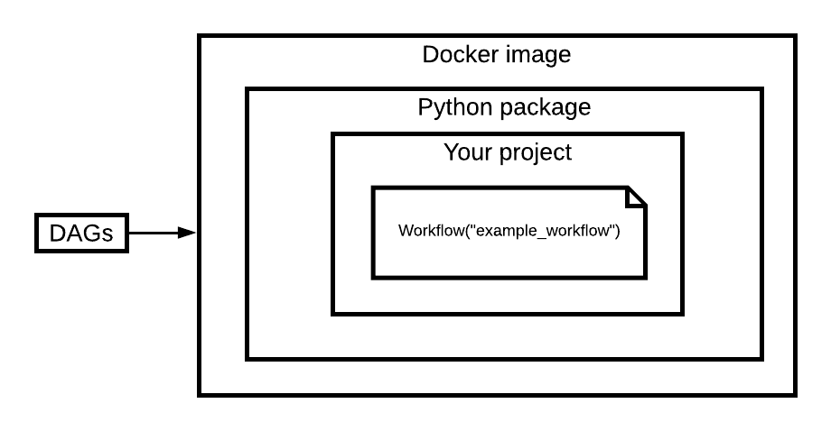

# Project structure and build

## Overview

In this chapter, you will get to know the anatomy of the standard BigFlow project, deployment artifacts, and [CLI commands](./cli.md).

The BigFlow build command packages your processing code into a Docker image. Thanks to this approach, you can create any
environment you want for your pipelines. What is more, you don't need to worry about dependencies clashes on the Cloud Composer (Airflow).

The scheme of a BigFlow deployment artifacts looks like this:



Your project is turned into a standard Python package (which can be uploaded to [pypi](https://pypi.org/) or installed locally using `pip`). 
Next, the package is closed into a Docker image with fixed Python version. Finally, there are Airflow DAGs that uses this image.

From each of your [workflows](./workflow-and-job.md#workflow), BigFlow generates a DAG file. 
Produced DAG consists only of [`KubernetesPodOperator`](https://airflow.apache.org/docs/stable/_api/airflow/contrib/operators/kubernetes_pod_operator/index.html) objects, which
execute operations on a Docker image.

To build a project you need to use the [`bigflow build`](./cli.md#building-airflow-dags) command. The documentation you are reading is also a valid BigFlow
project. Go to the `docs` directory and run the `bigflow build` command to see how the build process works. The `bigflow build`
command should produce three artifacts:

* The `dist` directory with a Python package
* The `image` directory with a deployment configuration and, optionally, with a Docker image as `.tar`
* The `build` directory with JUnit test results

The `bigflow build` command uses three subcommands to generate all the artifacts: [`bigflow build-package`](./cli.md#building-pip-package), [`bigflow build-image`](./cli.md#building-docker-image), [`bigflow build-dags`](./cli.md#building-dag-files).

Now, let us go through each building element in detail, starting from the Python package.

## Package

### Project structure

An example BigFlow project, with the standard structure, looks like this:

```
project_dir/
    project_package/
        __init__.py
        workflow.py
    test/
        __init__.py
    resources/
        requirements.txt
    Dockerfile
    project_setup.py
    deployment_config.py
```

Let us start with the `project_package`. It's the Python package which contains the processing logic of your workflows.
It also contains `Workflow` objects, which arranges parts of your processing logic into a [DAG](https://en.wikipedia.org/wiki/Directed_acyclic_graph).
Read the [Workflow & Job chapter](./workflow-and-job.md) to learn more about workflows and jobs.
The `project_package` is used to create a standard Python package that can be installed using `pip`.

The `project_setup.py` is the build script for the project. It turns the `project_package` into a `.whl` package. 
It's based on the standard Python tool - [setuptool](https://packaging.python.org/key_projects/#setuptools).

There is also a special variable - `PROJECT_NAME` inside the `project_setup.py`. In the example project, it should be 
`PROJECT_NAME = 'project_package'`. It tells BigFlow CLI, which package inside the `project_dir` is the main package with
your processing logic and workflows.

You can put your tests into the `test` package. The `bigflow build-package` command runs tests automatically, before trying to build the package.

The `resources` directory contains non-Python files. That is the only directory that will be packaged
along the `project_package` (so you can access these files after installation, from the `project_package`). Any other files
inside the `project_directory` won't be available for the `project_package`. `resources` can't be nested. So you can't
have a directory inside the `resources` directory.

The `get_resource_absolute_path` function allows you to access files from the `resources` directory, being inside the `project_package`.

[**`resources.py`**](examples/project_structure_and_build/resources_workflow.py)
```python
with open(get_resource_absolute_path('example_resource.txt', Path(__file__))) as f:
    print(f.read())
```

Run the example above, using the following command:

```shell script
bigflow run --workflow resources_workflow
```

Result:

```
Welcome inside the example resource!
```

The two remaining files - `Dockerfile` and `deployment_config.py` don't take a part in the Python package build process.

Because a BigFlow project is mainly a standard Python package, we suggest going through the 
[official Python packaging tutorial](https://packaging.python.org/tutorials/packaging-projects/).

### Package builder

The `bigflow build-package` command takes 3 steps to build a Python package from your project:

1. Cleans leftovers from a previous build.
1. Runs tests from the `test` package and generates JUnit xml report, 
using the [`unittest-xml-reporting`](https://pypi.org/project/unittest-xml-reporting/) package. You can find the generated report
inside the `project_dir/build/junit-reports` directory.
1. Finally, `bigflow build-package` runs the `bdist_wheel` setup tools command. It generates a `.whl` package that you can
upload to `pypi` or install locally - `pip install your_generated_package.whl`.

Go to the `docs` project and run the `bigflow build-package` command to observe the result. Now you can install the 
generated package using `pip install dist/examples-0.1.0-py3-none-any.whl`. After you install the `.whl` file, you can
run jobs and workflows from the `docs/examples` package. They are now installed in your virtual env, so you can run them
anywhere in your directory tree, for example:

```shell script
cd /tmp
bigflow run --workflow hello_world_workflow --project-package examples
```

You probably won't use this command very often, but it's useful for debugging. Sometimes you want to see if your project
works as you expect in the form of a package (and not just as a package in your project directory).

### Project versioning

Artifacts, like Python packages and Docker images, need to be versioned. BigFlow provides automatic versioning based on 
the git tags system. There are 2 commands you need to know.

The `bigflow project-version` command prints the current version of your project:

```
bigflow project-version
>>> 0.34.0
```

As you can see, the version scheme is a standard Python package version scheme:

`<major>.<minor>.<patch>`

If BigFlow finds a tag on the current commit, it uses it as a current project version. If there are commits after the last tag,
it creates a snapshot version with the following scheme:

`<major>.<minor>.<patch><snapshot_id>`

For example:

```
bigflow project-version
>>> 0.34.0SHAdee9af83SNAPSHOT8650450a
```

If you are ready to release new version, you don't have to set a new tag manually. You can use the `bigflow release` command:

```
bigflow project-version
>>> 0.34.0SHAdee9af83SNAPSHOT8650450a
bigflow release
bigflow project-version
>>> 0.35.0
```

## Image

To run a job in the desired environment, BigFlow makes use of Docker. Each job is executed from a Docker container, made
from your project Docker image. The default image generated from the scaffolding tool looks like this:

```dockerfile
FROM python:3.7
COPY ./dist /dist
COPY ./resources /resources
RUN apt-get -y update && apt-get install -y libzbar-dev libc-dev musl-dev
RUN for i in /dist/*.whl; do pip install $i; done
```

As you can see, the basic image installs the generated Python package. With the installed package, you can run a workflow or a job
from the Docker environment.

Run the `bigflow build-image` command inside the `docs` project. Next, run the following command to run the example workflow from the docker:

```shell script
docker run bigflow-docs:0.1.0 bigflow run --job hello_world_workflow.hello_world
```

And that's how jobs are being run after deployment, from a generated DAG. 

You can, of course, modify the image to your own needs.

## DAG

BigFlow generates Airflow DAGs from workflows that can be found in your project.

A generated DAG utilizes only the [`KubernetesPodOperator`](https://airflow.apache.org/docs/stable/_api/airflow/contrib/operators/kubernetes_pod_operator/index.html).

To see how it works, go to the `docs` project and run the `bigflow build-dags` command.

One of the generated DAGs, for the [`resources.py`](examples/project_structure_and_build/resources_workflow.py) workflow, looks like this:

```python
from airflow import DAG
from datetime import timedelta
from datetime import datetime
from airflow.contrib.operators import kubernetes_pod_operator

default_args = {
            'owner': 'airflow',
            'depends_on_past': True,
            'start_date': datetime.strptime("2020-08-31", "%Y-%m-%d") - (timedelta(hours=24)),
            'email_on_failure': False,
            'email_on_retry': False,
            'execution_timeout': timedelta(minutes=90)
}

dag = DAG(
    'resources_workflow__v0_1_0__2020_08_31_15_00_00',
    default_args=default_args,
    max_active_runs=1,
    schedule_interval='@daily'
)


tprint_resource_job = kubernetes_pod_operator.KubernetesPodOperator(
    task_id='print-resource-job',
    name='print-resource-job',
    cmds=['bf'],
    arguments=['run', '--job', 'resources_workflow.print_resource_job', '--runtime', '{{ execution_date.strftime("%Y-%m-%d %H:%M:%S") }}', '--project-package', 'examples', '--config', '{{var.value.env}}'],
    namespace='default',
    image='eu.gcr.io/docker_repository_project/my-project:0.1.0',
    is_delete_operator_pod=True,
    retries=3,
    retry_delay= timedelta(seconds=60),
    dag=dag)            
```