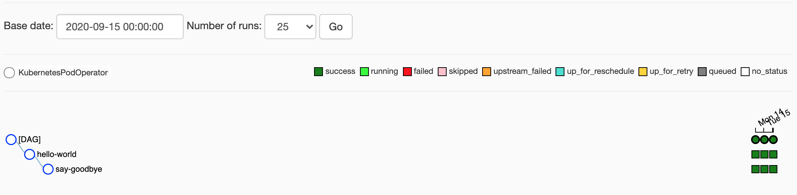

# BigFlow tutorial

In this tutorial, we show the complete "Hello, World!" example.
You will learn how to run the simplest BigFlow [workflow](workflow-and-job.md) on a local machine
and how to [deploy](deployment.md) it on Cloud Composer.    

## Setup

This tutorial is based on the [Docs](https://github.com/allegro/bigflow/tree/master/docs) project
located in the BigFlow repository.

Start from cloning this repository:

```bash
git clone https://github.com/allegro/bigflow.git
cd bigflow/docs
```

Then, [install the BigFlow](../README.md#installing-bigflow) PIP package
in a fresh virtual environment in the `docs` project directory.

Since you have installed the BigFlow PIP package, you can use [BigFlow CLI](cli.md). Test it:

```shell
bigflow -h
```

## Run the workflow on a local machine

In BigFlow, your project consists of [workflows](workflow-and-job.md).
You can run them directly from your local machine or deploy them to Cloud Composer as Airflow DAGs.

Our "Hello, World!" workflow is the simple Python code. It consists of two jobs.
The first one says Hello, and the second one says Goodbye:

[hello_world_workflow.py](examples/cli/hello_world_workflow.py):

```python
from bigflow.workflow import Workflow


class HelloWorldJob:
    def __init__(self):
        self.id = 'hello_world'

    def run(self, runtime):
        print(f'Hello world on {runtime}!')


class SayGoodbyeJob:
    def __init__(self):
        self.id = 'say_goodbye'

    def run(self, runtime):
        print(f'Goodbye!')


hello_world_workflow = Workflow(
    workflow_id='hello_world_workflow',
    definition=[
        HelloWorldJob(),
        SayGoodbyeJob()])
```

The [`bigflow run`](cli.md#running-workflows) command lets you run this workflow directly
from sources on your local machine (without building and deploying it to Composer). 

### Examples

Run the whole workflow:

```shell
bigflow run --workflow hello_world_workflow
```

Output:

```text
Hello world on 2020-09-10 12:17:52!
Goodbye!
```

Run the single job:

```shell
bigflow run --job hello_world_workflow.say_goodbye
```

Output:

```text
Goodbye!
```

Run the workflow with concrete [runtime](workflow-and-job.md#the-runtime-parameter):

```shell
bigflow run --workflow hello_world_workflow --runtime '2020-08-01 10:00:00'
```

Output:
```text
Hello world on 2020-08-01 10:00:00!
Goodbye!
```

## Deploy the workflow on Cloud Composer

Executing workflows locally is great for development, but finally
you want them to be executed periodically by Google Cloud Composer.

One of the key features of BigFlow is the full automation of the build and deployment process.

Before you start, you have to [set up](deployment.md#gcp-runtime-environment)
a GCP environment, which consist of two services:

* a [Cloud Composer](deployment.md#cloud-composer) instance
* a [Docker Registry](deployment.md#docker-registry)
 
Then, add the configuration of your environment to the [deployment_config.py](deployment_config.py) file.
For the purpose of this example, it's enough to set these two properties:
`gcp_project_id` and `dags_bucket`:

```python
from bigflow import Config

deployment_config = Config(
    name='dev',
    properties={
        'gcp_project_id': 'my_gcp_project_id',
        'docker_repository': 'eu.gcr.io/{gcp_project_id}/docs-project',
        'dags_bucket': 'my_composer_dags_bucket'
    })
```  

[Read more](deployment.md#managing-configuration-in-deployment_configpy) about `deployment_config.py`.

### Build the deployment artifacts

There are two deployment artifacts, which are being [built](project_setup_and_build.md) from your BigFlow
project:

1. Airflow [DAG](project_setup_and_build.md#dag) files with workflows definitions,
1. Docker [image](project_setup_and_build.md#docker-image) with workflows computation code.

Build both artifacts with the single command
(we recommend to focus one the single workflow here, you can build all workflows in your project
by skipping the `workflow` parameter):

```shell
bigflow build --workflow hello_world_workflow
```

List the freshly generated deployment artifacts:

```bash
ls .dags
```

Output:

```text
hello_world_workflow__v0_1_0__2020_09_11_11_00_00_dag.py
```

```bash
ls image
```

Output:

```text
deployment_config.py    image-0.1.0.tar
```

Read more about the [`bigflow build`](cli.md#building-airflow-dags) command.
 
### Deploy to GCP

Your final task is to [deploy](deployment.md) the artifacts on Cloud Composer.
 
When deploying from a local machine, we recommend using the local [authentication method](deployment.md#authentication-methods).
It relies on your personal GCP account, through `gcloud` tool.

Check if you are authenticated:

```bash
gcloud info
```

If not, run the following command:

```bash
gcloud auth application-default login
```
 
Deploy your workflow to Cloud Composer:

```bash
bigflow deploy
```  
  
Wait a while till Airflow reads the new DAG file and check your Airflow UI. 
If you see this picture it means that you nailed it!



Read more about the [`bigflow deploy`](cli.md#deploying-to-gcp) command.

## Workflow configuration

In BigFlow, project environments are configured by
[`bigflow.Config`](configuration.md) objects.
Here we show how to create the workflow which prints different messaged for each environment.

[`hello_config_workflow.py`](examples/cli/hello_config_workflow.py):

```python
from bigflow import Config
from bigflow.workflow import Workflow


config = Config(name='dev',
                properties={
                        'message_to_print': 'Message to print on DEV'
                }).add_configuration(
                name='prod',
                properties={
                       'message_to_print': 'Message to print on PROD'
                })


class HelloConfigJob:
    def __init__(self, message_to_print):
        self.id = 'hello_config_job'
        self.message_to_print = message_to_print

    def run(self, runtime):
        print(self.message_to_print)


hello_world_workflow = Workflow(
    workflow_id='hello_config_workflow',
    definition=[HelloConfigJob(config.resolve_property('message_to_print'))])

```

### Examples

Run the workflow with `dev` config:

```shell
bigflow run --workflow hello_config_workflow --config dev
```

Output:

```text
bf_env is : dev
Message to print on DEV
```

Run the workflow with `prod` config:

```shell
bigflow run --workflow hello_config_workflow --config prod
```

Output:

```text
bf_env is : prod
Message to print on PROD
```

Run the workflow with the default config, which happened to be `dev` config:

```shell
bigflow run --workflow hello_config_workflow
```

Output:

```text
bf_env is : dev
Message to print on DEV
```

Read more about the [`bigflow run`](cli.md#running-workflows) command.